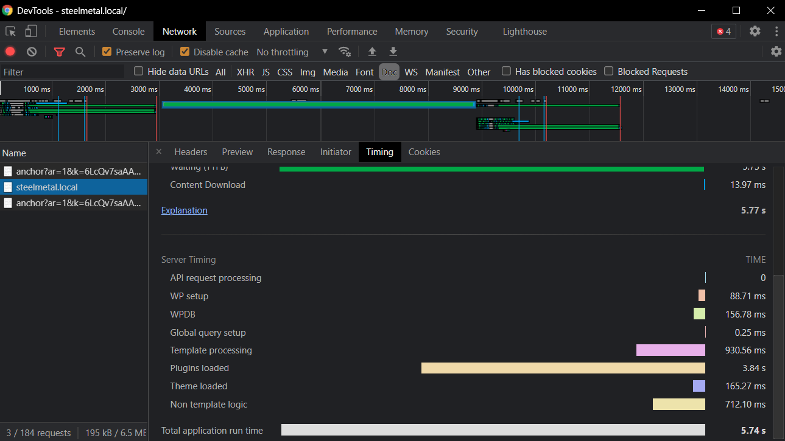

# WordPress Server Timing

Add Server-Timing header information from within your WordPress sites.

## Requirements

- PHP 7

## Installation

1. Copy the `wordpress-server-timing` folder to `wp-content/plugins`.
2. Activate the plugin through the WordPress admin panel.

## Usage

By default, the plugin measures only nine things, to keep it as light-weight as possible:

- WP setup (time between request start to WP internal timer start)
- Plugins loaded (time of loading all plugins including mu-plugins)
- Global query setup (time between plugins loaded and theme loading)
- Theme loaded (time of loading the theme and running on-the-fly functions.php logic)
- Non template logic (time between theme load and wp_loaded hook)
- Template processing (basically time of rendering the current template)
- API request processing (if API request is sent, otherwise 0)
- WPDB (time of all DB query if `SAVEQUERIES` is set to truthy)
- Total application run time

Once the package is successfully installed, you can see your timing information in the developer tools of your browser. Here's an example from Chrome:

## License

The MIT License (MIT). Please see [License File](LICENSE.md) for more information.
